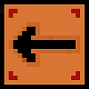
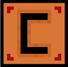
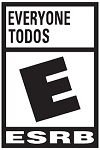

# SIEMPRE A TU LADO

### **AUTORES:**

Karen Daniela Guzmán Ortiz    _Código:_ 2191741

Juan Manuel Ramirez Salamanca    _Código:_ 2192279

_Curso:_ Programación de Computadores I UIS  _Grupo:_ D2

### **DESCRIPCIÓN:**

Al inicio del juego podrás conocer la historia, lo que te permitirá apropiarte del papel y hacer lo posible por ayudar a Sammy.

El juego consiste en ayudar a una ballena de juguete que se ha perdido en el fondo del mar a regresar con su dueña, quien desde la playa añora regresar con su juguete favorito.

Imágenes descriptivas del juego

1. Al iniciar el juego aparecerá el siguiente menú

2. Este es el escenario, donde se desarrolla el juego

3. Al pausar el juego se mostrará lo siguiente

4. Al perder se mostrará lo siguiente, además por medio de los botones tendrás posibilidad de seguir jugando, descarsar según lo prefieras.

### **CARACTERÍSTICAS**

Se trata de un juego de plataforma ideal para niños mayores de 9 años en adelante, que sepan leer, quienes quedarán encantados con la historia de Sammy, además el juego tiene un mensaje acerca de la contaminación, pues es la basura del mar es la que genera la dificultad al momento de conducir a Sammy.

Por favor antes de ejecutar el programa añada las librería: 
- Minim

### **INSTRUCCIONES, CONTROLES Y ACCIONES:**

Para controlar a Sammy utiliza las flechas.

Presiona flecha arriba para dirigirte hacia arriba

Presiona flecha abajo para dirigirte hacia abajo

Presiona flecha derecha para dirigirte hacia la derecha.

Presiona flecha izquierda para dirigirte hacia la izquierda.

Presiona P para poner el juego en pausa.

Si has pausado el jeugo, presiona C para continuar jugando

Toca las pilas, y así obtendrás un aumento de velocidad.

Evita chocar con la basura, pues cada choque disminuirá la vida de la ballena.

### **CLASIFICACIÓN:**

El contenido de este juego está dirigido para todo público.

### **TRAILER - GAMEPLAY:**

Enlace: https://youtu.be/mSJmKWa_3gg

### **CRÉDITOS:**

**Programación**

Juan Manuel Ramirez Salamanca

Karen Daniela Guzman Ortiz

**Sonido y Música**

Juan Manuel Ramirez Salamanca

Algunos de las sonidos están basados en partituras de de las siguientes páginas web:

-https://sheet.host/

**Modelado, diseño y Animación de personajes**

Karen Daniela Guzman Ortiz

Algunas de las imágenes están basadas en imágenes de de las siguientes páginas web:

-https://www.freepng.es/hd-png/electric-current,4.html

-https://www.shutterstock.com/es/image-vector/retro-pixel-8-bit-background-beach-1087703117

**Agradecimientos**

A Cesar Augusto Ramírez Salamanca y Maria Fernanda Guzmán Ortiz por probrar cada versión del juego y sugerirnos cambios.

A Andrés Pinzón por consejos y asesoría en cuanto al diseño.

### **REFERENCIAS:**

En la creación de este codigo se usaron como guia las siguientes pagínas:
- https://processing.org/reference/PVector.html
- https://processing.org/reference/fullScreen_.html
- https://processing.org/reference/fullScreen_.html
- https://processing.org/reference/exit_.html
